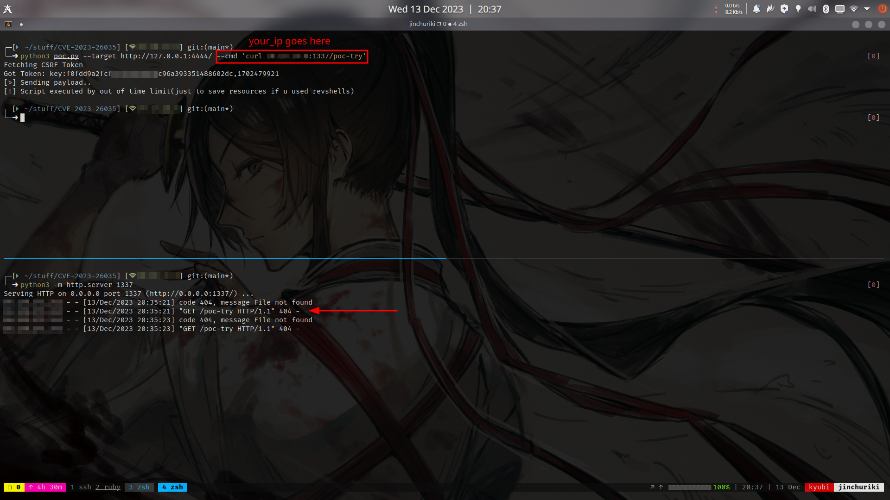
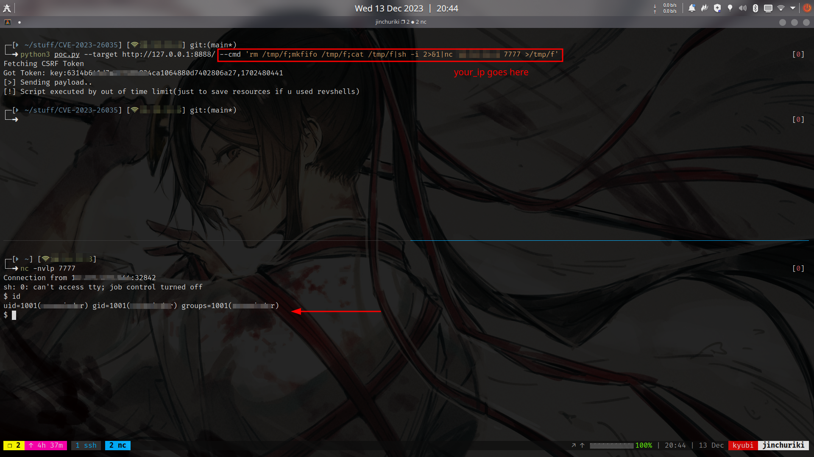

# POC for CVE-2023-26035

> Works for ZoneMinder (Versions prior to 1.36.33 and 1.37.33)
- Vulnerability : Remote Code Execution (RCE)


# Usage

```bash
└─➜ python3 poc.py -h
usage: poc.py [-h] --target TARGET --cmd CMD
poc.py: error: the following arguments are required: --target, --cmd

```

## Curl 

- Before jumping to rev shell, try this first, if you get hit, the service is vulnerable



## Reverse Shell



# References : 

https://nvd.nist.gov/vuln/detail/CVE-2023-26035 <br />
https://github.com/rapid7/metasploit-framework/blob/master//modules/exploits/unix/webapp/zoneminder_snapshots.rb

## NOTE
> This script is just an alternate version for metasploit-framework script.
